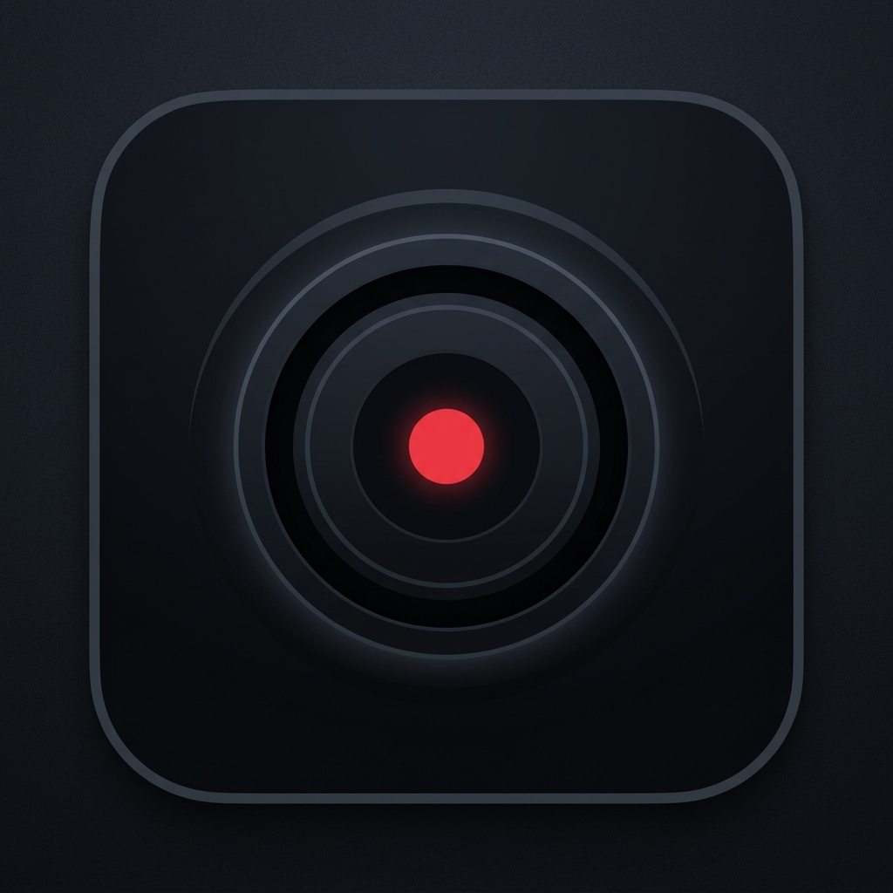

<div align="center">
  
  
  # 🎥 OffScreen Rec: Stealth Background Video & Audio Recorder
</div>

OffScreen Rec is a highly optimized, battery-efficient, and discreet background video and audio recording application designed for Android devices. Engineered entirely in **Kotlin** with **Jetpack Compose**, **CameraX**, and **Material Design 3**, OffScreen empowers users to capture secure media streams in a process-bounded background layer, even when the display is completely shut off.

---

## 🌟 Major Highlights & Core Concepts

OffScreen operates purely locally. Your privacy is paramount: there are no cloud uploads, telemetry pings, or secondary servers. All recordings remain permanently on your local device repository until you explicitly delete them.

### 🛡️ 1. Uninterruptible Foreground Engine
To guarantee robust data capture, the application initializes an Android **Foreground Service**. This binds the Camera pipeline closely with the Android kernel to ensure the recording session continues flawlessly without corruption, even when you minimize the app, switch to a game, or power off the phone display.

### 🔋 2. Dynamic Hardware tuning & Battery Conversator
Long recording sessions historically destroy mobile batteries. OffScreen introduces granular controls:
*   **Frame-Rate Limiting**: Downscale your capture frame rate to **15 FPS** or **24 FPS**. Underclocking the frame-target dynamically reduces CPU utilization and prevents thermal throttling limiters from kicking in during prolonged or overnight recording sessions.
*   **Resolution Tuning**: Dynamically switch the target resolution (1080p FHD, 720p HD, 480p, 360p, 214p) to maximize available internal storage. 

### 🗄️ 3. Permanent Local Persistence & Sandbox Storage
All data is permanently stored via **Room Orm SQLite** on the local device storage.
*   **Guaranteed Preservation**: All videos, logs, markers, and metadata are saved permanently until the user authorizes a deletion.
*   **Safe Sweeps**: The deletion system uses a streamlined confirmation alert framework to ensure clean UI while preventing accidental removal of critical recordings.
*   **Diagnostic Storage Engine**: Queries the actual OS `StorageManager` dynamically, calculating precise free/total metrics of your physical partition.

### 🔇 4. Stealth Operational Modes
OffScreen integrates a variety of low-profile monitoring functions:
*   **Disabled Audio**: Strip the audio stream entirely to save space and respect environmental restrictions.
*   **Invisible Notifications**: Users can dynamically remove ongoing system notification payloads to operate even stealthier.

---

## 📂 System Architecture Breakdown

The project relies heavily on the clean architecture separation of concerns:

```text
/app/src/main/java/com/example/
│
├── MainActivity.kt               # Central Host Activity & Compose System Initialization
│
├── data/
│   ├── RecordingLog.kt           # Room ORM Entity caching detailed media pointers
│   ├── RecordingDao.kt           # Room Database access definitions (Insert, Delete, Sort)
│   ├── RecordingDatabase.kt      # Main SQLite schema provider
│   ├── RecordingRepository.kt    # Repository managing logs & filesystem mapping
│   └── SettingsManager.kt        # Persistent Preferences (Resolutions, Audio, FPS)
│
├── service/
│   └── CameraRecordingService.kt # Deep hardware pipeline: CameraX to Foreground boundary
│
├── viewmodel/
│   └── RecordingViewModel.kt     # Unidirectional Data Flow Coroutine dispatcher
│
└── ui/
    └── Screens.kt                # Jetpack Compose UI: Dashboard, Library, Setup, Dialogs
```

---

## ⚙️ Core Technical Specifications

*   **Language**: Pure Kotlin with Coroutines & Flows
*   **Build Target**: API Level 34+ (Android 14 ready)
*   **UI Framework**: Jetpack Compose Native Declarative UI
*   **Database**: Room Database (SQLite Engine)
*   **Camera Integration**: Jetpack CameraX & Camera2 API Interop
*   **Styling**: Material Design 3 (M3)

---

## 🔐 Licensing & Certification

All source code and internal functional modules are provided under the terms of the **MIT License**. The codebase is freely available for educational reference, extension, and non-commercial application. 

*Your data is entirely owned by you. The local sandbox does not feature network access for data exfiltration.*

---

## ✍️ Developer Creed & Notes

> *"And man will have nothing except what he strives for" (Al-Quran 53:39)*

* **Developer Profile:** Rehan Ahmad
* **Mission:** *doing my part. the rest is His*
* **Links**:
  - [GitHub Profile](https://github.com/Ft976)
  - [LinkedIn Profile](https://www.linkedin.com/in/rehan-ahmad-863386382)
